# End-to-End-Customer-Churn-Prediction-Engine-AI-Powered-Insights-Real-Time-Reporting

<h3>The site is live, please feel free to visit:</h3>

<!-- *To Live Demo :  [End-to-end customer churn prediction model](https://end-to-end-customer-churn-prediction-engine-ai-powered.streamlit.app/)* -->

*To Live Demo :  <a href="https://end-to-end-customer-churn-prediction-engine-ai-powered.streamlit.app/" target="_blank">End-to-end customer churn prediction model</a>* *(Right-click to open in a new tab)*

*Image Source: [Customer Churn](https://www.universalcreativesolutions.com/insights/post/how-to-reduce-customer-churn-rate-ccr)*

This is an end-to-end customer churn prediction app with FastAPI at the backend, ExtraTreesClassifier as the prediction model, Streamlit for the frontend, with SHAP explanations, and AI-generated retention reports.

The dataset that is used in this project was downloaded from Kaggle and here is the link to the dataset: 
*Data Source: [Telco Customer Churn](https://www.kaggle.com/datasets/blastchar/telco-customer-churn)*

## Table of Contents

<ol>
<li><a href="#Overview"><b> Overview </a></b></li>
<li><a href="#Datasets"><b> Datasets </a></b></li>
<li><a href="#EDA"><b> Exploratory Data Analysis </a></b></li>
<li><a href="#datapreprocessing"><b> Data Preprocessing </a></b></li>
<li><a href="#spotchecking"><b> Spot Checking Algorithms </a></b></li>
<li><a href="#optimization"><b> Hyper-Parameter Optimization </a></b></li>
<li><a href="#finalization"><b> Model Finalization </a></b></li>
<li><a href="#saveload"><b> Saving & Loading the Model </a></b></li>
<li><a href="#conclusion"><b> Conclusion </a></b></li>
</ol>

<h2 id="Overview">1. Overview</h2>
This project is an end-to-end Customer Churn Prediction App that integrates a FastAPI backend with an ExtraTreesClassifier machine learning model. The frontend is built using Streamlit, providing an interactive user interface. The app includes SHAP-based model interpretability to explain predictions and features AI-generated customer retention reports, offering actionable insights for business decision-making.

<h2 id="Datasets">2. Dataset</h2>
The data as downloaded as a CSV file from Kaggle and to mimic the real world scenario, a <b>Customer table</b> has been created and the data has been loaded in that table. For database, <b>PostgreSQL</b> has been used.
Then after authentication and creating a connection, a function <i>load_all_data()</i> is responsible to load the data from the database, which has been called in a Jupyter Notebook for machine learning tasks.

<h2 id="EDA">3. EDA</h2>

<h3> First the data is loaded: </h3>

<h3> Dimension of the dataset: </h3>

<h3> Checking for NULL values: </h3>

<h3> Checking the data types: </h3>

<h3> Data Exploration with Visualization: </h3>

This is a pure case of class imbalance. As we can see, the classes are imbalanced, the count of Non-Churn is way higher than the count of the Churn.

<h3> Handling Class Imbalance: </h3>

Here, the minority class (Class 1) has been oversampled.

So, later on the stage, we will be using both the balanced Vs the imbalanced dataset and see on which datasets, the model will generate the best result and accordingly drop one of the dataset.

<h3> Visualizing Numerical Features: </h3>

<b> Histogram:</b>

<b> Density Plot:</b>

<b> Box Plot:</b>

<h2 id="#datapreprocessing">4. Data Preprocessing</h2>

<h3> Encoding: </h3>
The categorical data doesn't have Ordinal data, and these categorical data also doesn't have too much cardinality, so here, I will be using `One-hot Enoding` to encode these categorical data.

So, a function has been created that takes in a dataframe, separates the categorical and numerical features, performs `OneHotEncoder()` on categorical features, and returns the numerical features and the encoded categorical data as a dataframe.

<b> Encoding both original data(class imabalance dataset) and the balanced dataset:</b>

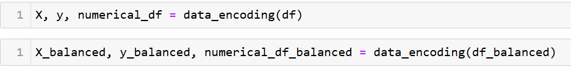

<h3> Correlation:</h3>

First, the correlation has been calculated and plotted as a heatmap for both original and balanced dataset:

<b> Correlation Heat Map for Original Dataset: </b>

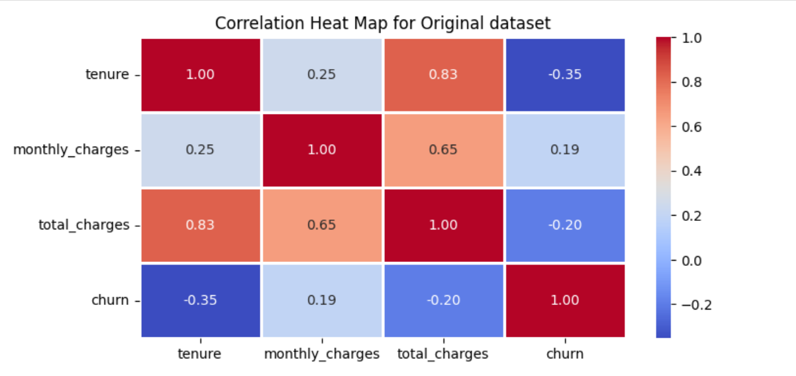

<b> Correlation Heat Map for Balanced Dataset: </b>
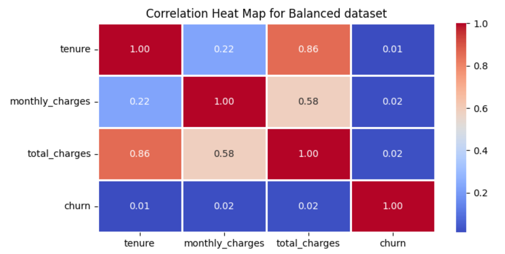

<h3> Multi-Collinearity (VIF): </h3>

**NOTE:**  The threshold has been set as 10. VIF above the threshold of 10 would be considered having Multi-collinearity.

<b> Multi-collinearity test on original dataset:</b>

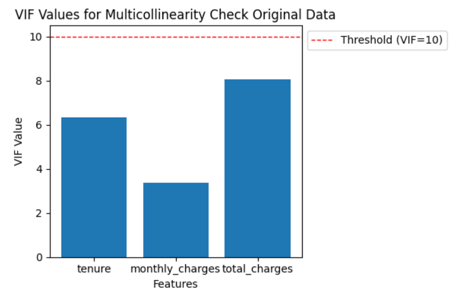

<b> Multi-collinearity test on balanced dataset:</b>

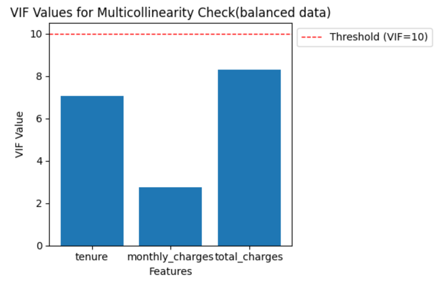

<h2 id="#spotchecking">5. Spot Checking Algorithms</h2>

**NOTE:** 
Models that are used below:  
LR:  `LogisticRegression()`  
LDA:  `LinearDiscriminantAnalysis()`  
CART:  `DecisionTreeClassifier()`  
SVM:  `SVC()`  
NB:   `GaussianNB()`  
KNN: `KNeighborsClassifier()`  
AB: `AdaBoostClassifier()`  
GBM: `GradientBoostingClassifier`  
RF: `RandomForestClassifier()`  
ET:  `ExtraTreesClassifier()`

<h3> Spot Checking on Original Dataset: </h3>
So, first we will test out 6 algorithms then use Ensemble Models on the original dataset without scaling data then again we will scaled the data and compare the results:

<b> Train-Test split: </b>

<b> Original data unscaled: </b>

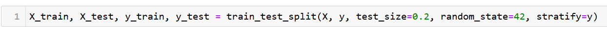

Metrics:
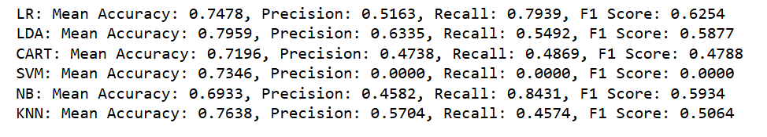

These `F1-Score` are not so good and `SVM` gave 0 for precision, recall and F1-score,  which shows how sensitive is it to unscaled data.

<b> Original data scaled: </b>
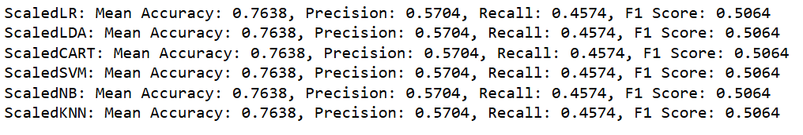

After the data has been scaled, for `SVM` it went from 0 to 0.5064 for `F1-score` on scaled data.

Using `Ensemble Models` on the original dataset, as Ensemble model are robust to scalings, I will be using the original dataset directly without scaling them:

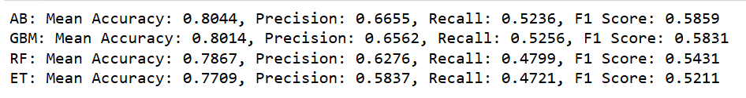

<h3> Spot Checking on Blanaced Dataset: </h3>

<b> Train-Test split: </b>

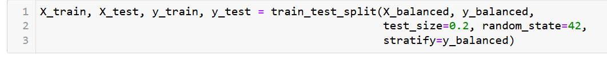

<b> Balanced data unscaled: </b>

Metrics:
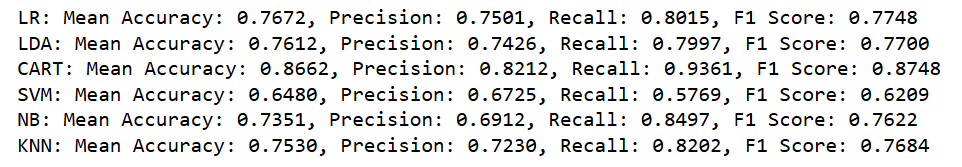

<b> Balanced data scaled: </b>

Metrics:

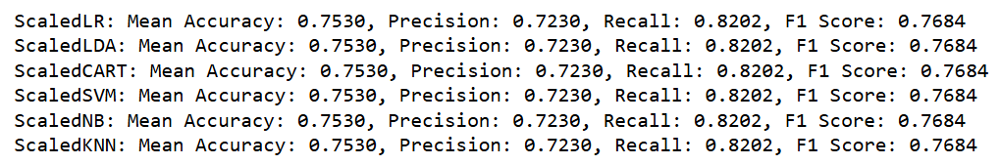

<b> Balanced data Ensemble Models: </b>
Using `Ensemble Models` on the balanced dataset, as Ensemble model are robust to scalings, I will be using the balanced dataset directly without scaling them:

Metrics:
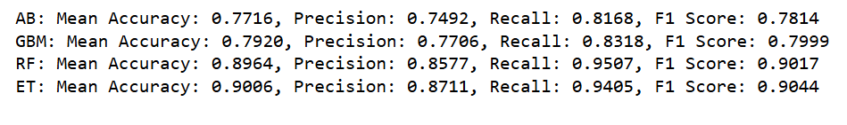

Till now, `Ensemble Model` gave the best results, not just from the accuracy perspective, but other metrics like `F1-score, Precision, and Recall`. `Accuracy` is not a good metrics since our data has `Class Imbalance` problem, and in such scenario, other metrics should be considered.

So, till now, we have got two best models from the ensemble section and the best result was from the `balanced` dataset. So, I will be moving forward with the balanced dataset and those two models.

They are:
1. `ExtraTreesClassifier` and 
2. `RandomForest`

Now, I will be moving forward with these two models and optimize the `Hyper-parameter` using `GridSearchCV` and finalize the best model.

<h2 id="optimization">6. Hyper-Parameter Optimization</h2>
 
<b>  `RandomForestClassifier`  </b>

First, the `train-test` split is done:

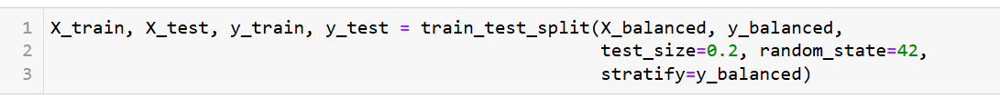

Then the `hyper-parameters` are defined as a dictionary:

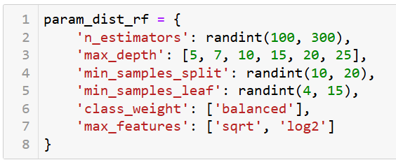

Then the `Random Forest` is trained on these combinations of  `hyper-parameters` and the best ones are saved as below:

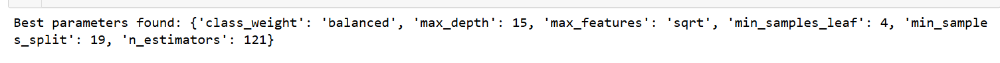

So, now, I have the best `hyper-parameters` for the `Random Forest` and these are used to re-train the model and fit on the training dataset:

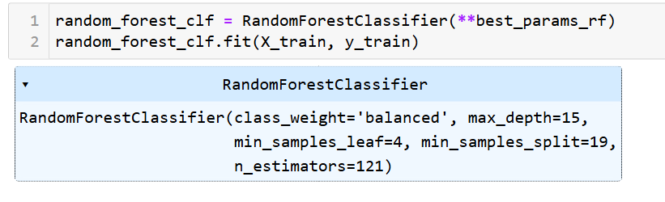

<b> Classification Report on both `Training` and `Testing` : </b>

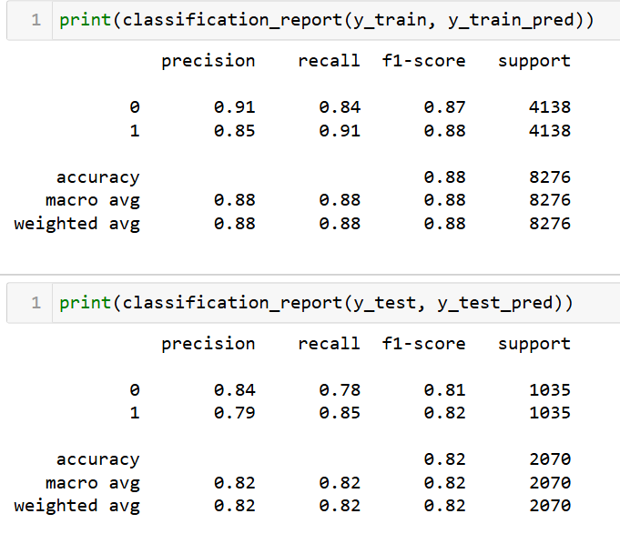

<b> If we compare the `accuracy` the training data has `88%` while the testing data has `82%`, there is some overfitting. </b>

Now, let's move onto `ExtraTreesClassifier`.

<b> `ExtraTreesClassifier` </b>

