# End-to-End-Customer-Churn-Prediction-Engine-AI-Powered-Insights-Real-Time-Reporting

<h3>The site is live, please feel free to visit:</h3>

<!-- *To Live Demo :  [End-to-end customer churn prediction model](https://end-to-end-customer-churn-prediction-engine-ai-powered.streamlit.app/)* -->

<a href="https://end-to-end-customer-churn-prediction-engine-ai-powered.streamlit.app/" target="_blank">End-to-end customer churn prediction model</a>

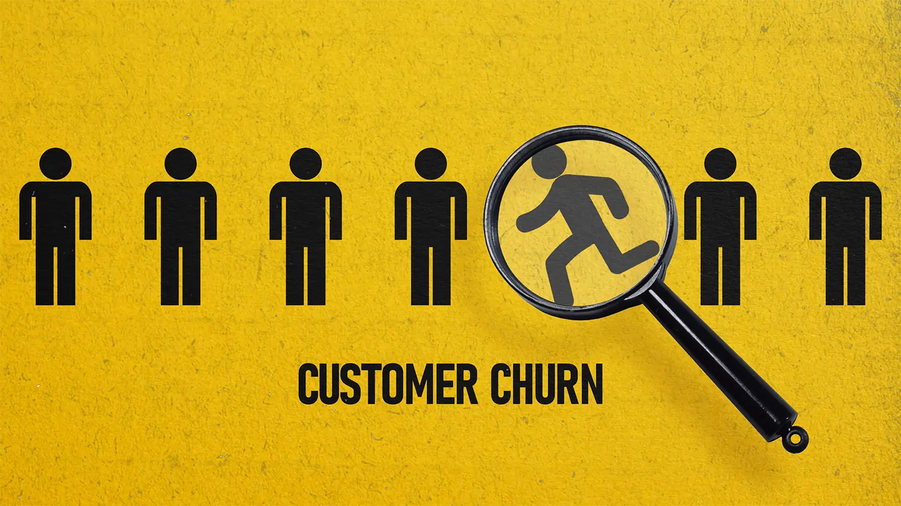

*Image Source: [Customer Churn](https://www.universalcreativesolutions.com/insights/post/how-to-reduce-customer-churn-rate-ccr)*

This is an end-to-end customer churn prediction app with FastAPI at the backend, ExtraTreesClassifier as the prediction model, Streamlit for the frontend, with SHAP explanations, and AI-generated retention reports.

The dataset that is used in this project was downloaded from Kaggle and here is the link to the dataset: 
*Data Source: [Telco Customer Churn](https://www.kaggle.com/datasets/blastchar/telco-customer-churn)*

## Table of Contents

<ol>
<li><a href="#Overview"><b> Overview </a></b></li>
<li><a href="#Datasets"><b> Datasets </a></b></li>
<li><a href="#EDA"><b> Exploratory Data Analysis </a></b></li>
<li><a href="#datapreprocessing"><b> Data Preprocessing </a></b></li>
<li><a href="#summary"><b> Summary Till Now </a></b></li>
<li><a href="#tuning"><b> Model Tuning </a></b></li>
<li><a href="#finalization"><b> Model Finalization </a></b></li>
<li><a href="#saveload"><b> Saving & Loading the Model </a></b></li>
<li><a href="#conclusion"><b> Conclusion </a></b></li>
</ol>

<h2 id="Overview">1. Overview</h2>
This project is an end-to-end Customer Churn Prediction App that integrates a FastAPI backend with an ExtraTreesClassifier machine learning model. The frontend is built using Streamlit, providing an interactive user interface. The app includes SHAP-based model interpretability to explain predictions and features AI-generated customer retention reports, offering actionable insights for business decision-making.

<h2 id="Datasets">2. Dataset</h2>
The data as downloaded as a CSV file from Kaggle and to mimic the real world scenario, a <b>Customer table</b> has been created and the data has been loaded in that table. For database, <b>PostgreSQL</b> has been used.
Then after authentication and creating a connection, a function <i>load_all_data()</i> is responsible to load the data from the database, which has been called in a Jupyter Notebook for machine learning tasks.

<h2 id="EDA">3. EDA</h2>

<h3> First the data is loaded: </h3>

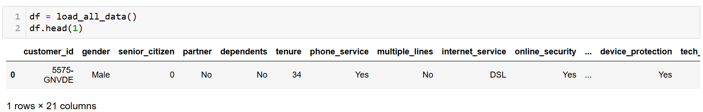

<h3> Dimension of the dataset: </h3>

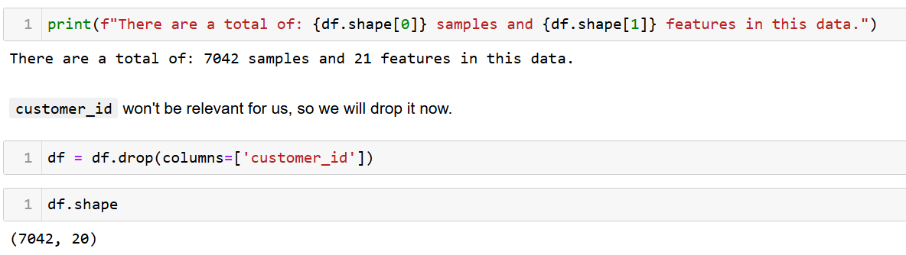

<h3> Checking for NULL values: </h3>

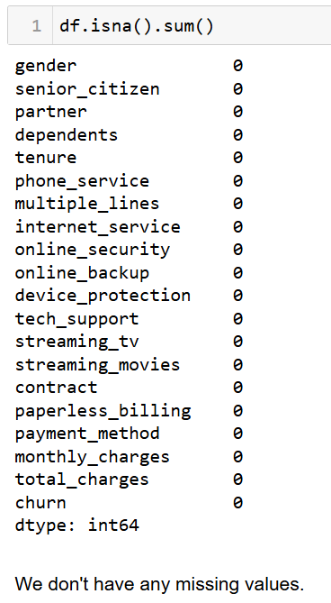

<h3> Checking the data types: </h3>

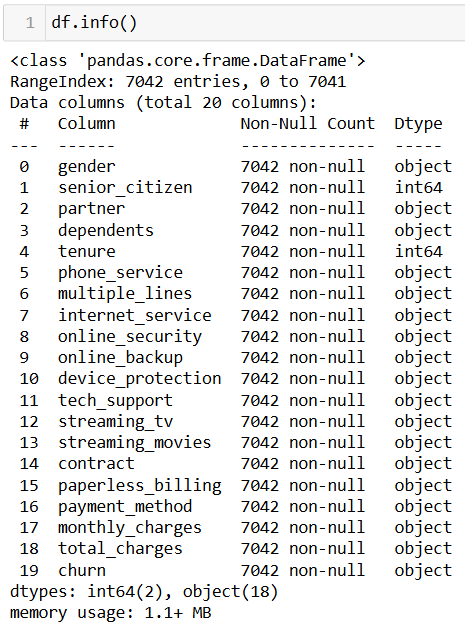

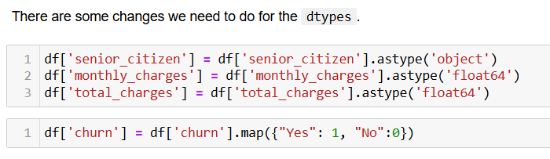

<h3> Data Exploration with Visualization: </h3>

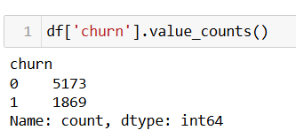

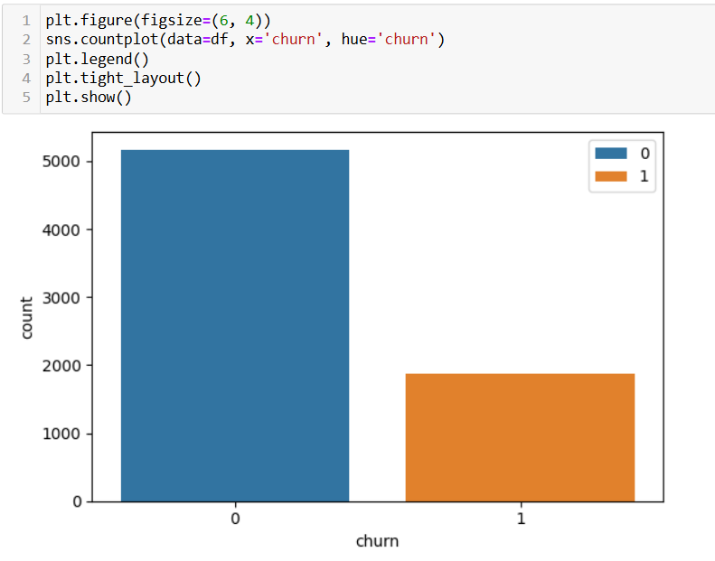

This is a pure case of class imbalance. As we can see, the classes are imbalanced, the count of Non-Churn is way higher than the count of the Churn.

<h3> Handling Class Imbalance: </h3>

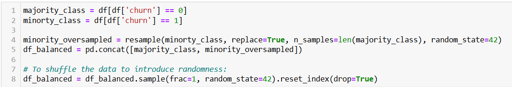

Here, the minority class (Class 1) has been oversampled.

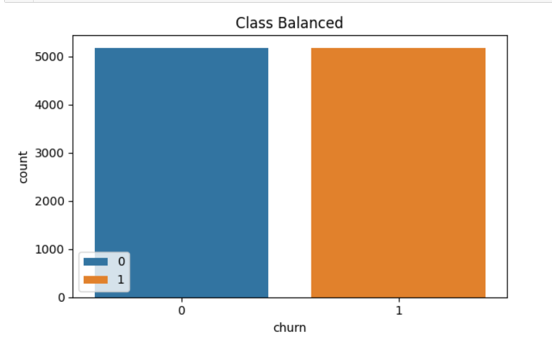

So, later on the stage, we will be using both the balanced Vs the imbalanced dataset and see on which datasets, the model will generate the best result and accordingly drop one of the dataset.

<h3> Visualizing Numerical Features: </h3>

<b> Histogram:</b>

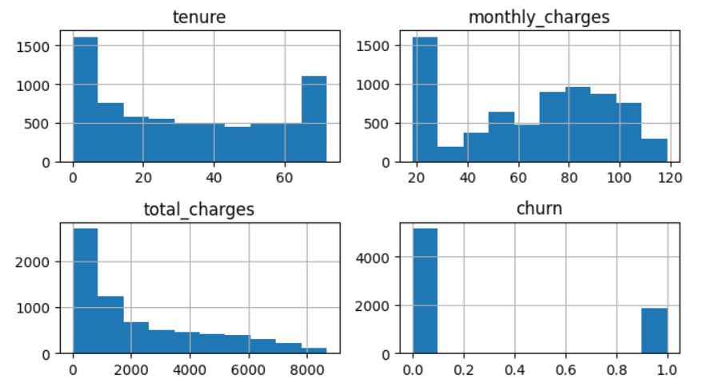

<b> Density Plot:</b>

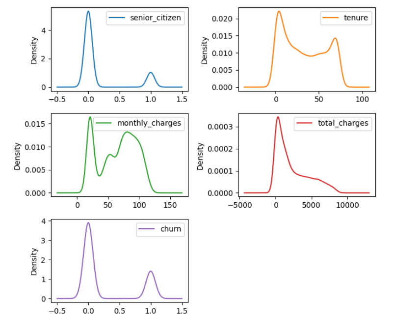

<b> Box Plot:</b>

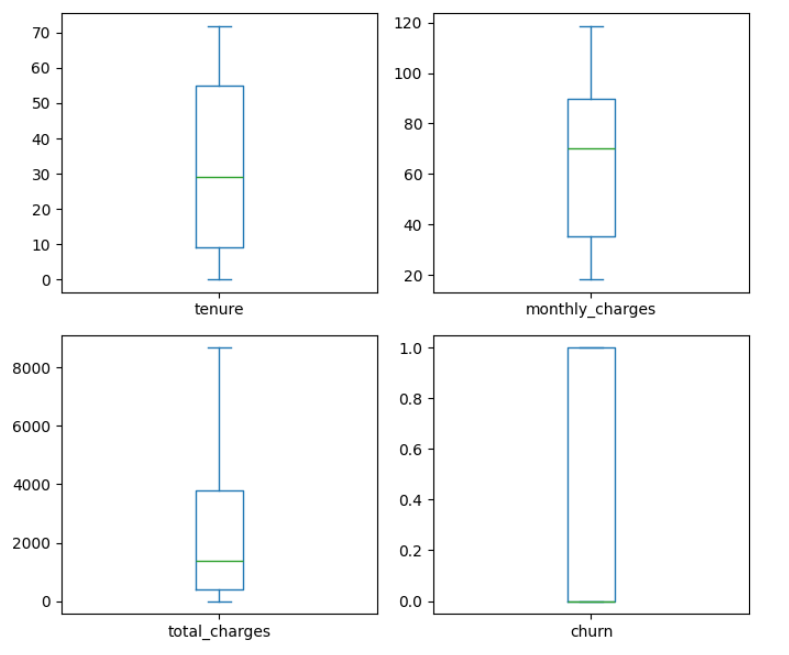

<h2 id="#datapreprocessing">4. Data Preprocessing</h2>

